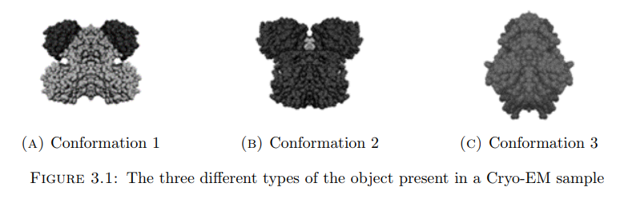
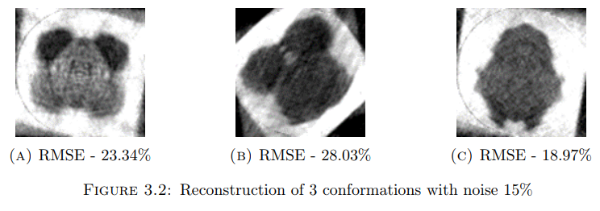
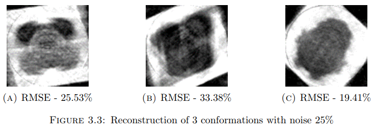
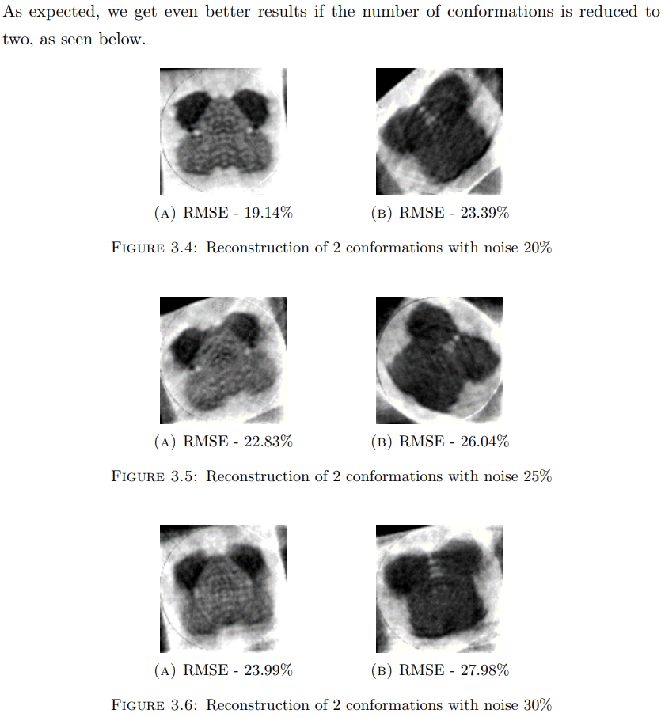

# Analysis of heterogeneity and symmetry in tomographic structure determination
**[[Full Text][4]]**, **[[Code][5]]**

## Abstract
A picture is a key to understanding. Scientific breakthroughs often build upon the successful
visualization of objects invisible to the human eye. However, biochemical maps have long been filled
with blank spaces because the available technology has had difficulty generating images of much of
life’s molecular machinery. Cryo-electron microscopy changes all of this. Researchers can now freeze
biomolecules mid-movement and visualize processes they have never previously seen, which is
decisive for both the basic understanding of life’s chemistry and for the development of
pharmaceuticals. However, most molecular complexes appear to exhibit intrinsic conformational
variability necessary to perform their functions. Even relatively stable macromolecular machines
such as the ribosome undergo significant conformational changes during their functional cycle and
therefore can occur in a mixture of conformational states. Thus, for most of the macromolecular
complexes studied, sample heterogeneity appears to be a major obstacle in structure determination
in addition to difficulties caused by low SNR of the data. It is now increasingly recognized that
sample heterogeneity constitutes a major methodological challenge for cryo-EM. This thesis aims to
develop multi-conformation reconstruction techniques where we’ll try to reconstruct different
coexisting structures from the same sample.

## Results
In this section, I present a complete set of results on the algorithm described. Using this
algorithm, we demonstrate how to successfully tackle all the problems mentioned earlier
and achieve good quality reconstructions of all the conformations of the original object.
The images used for our experiments were taken from the [Database of Macromolecular
Movements][6] and the image sizes used were 200 × 200. The images used are shown
below -

  

    
  

## Reconstructions

  

    
  

  

    
  

  

    
  

[4]: https://arunabh98.github.io/reports/thesis_report.pdf
[5]: https://github.com/Arunabh98/Heterogeneity-Tomography
[6]: http://molmovdb.org/
